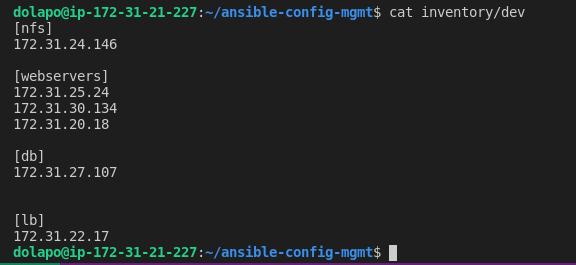
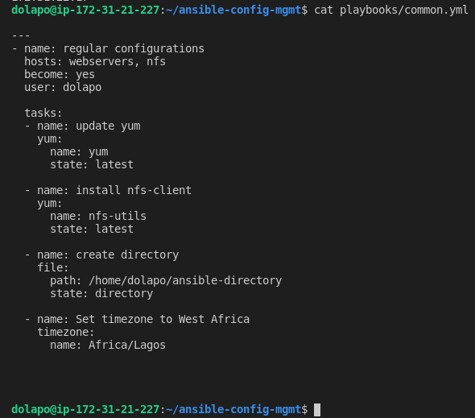
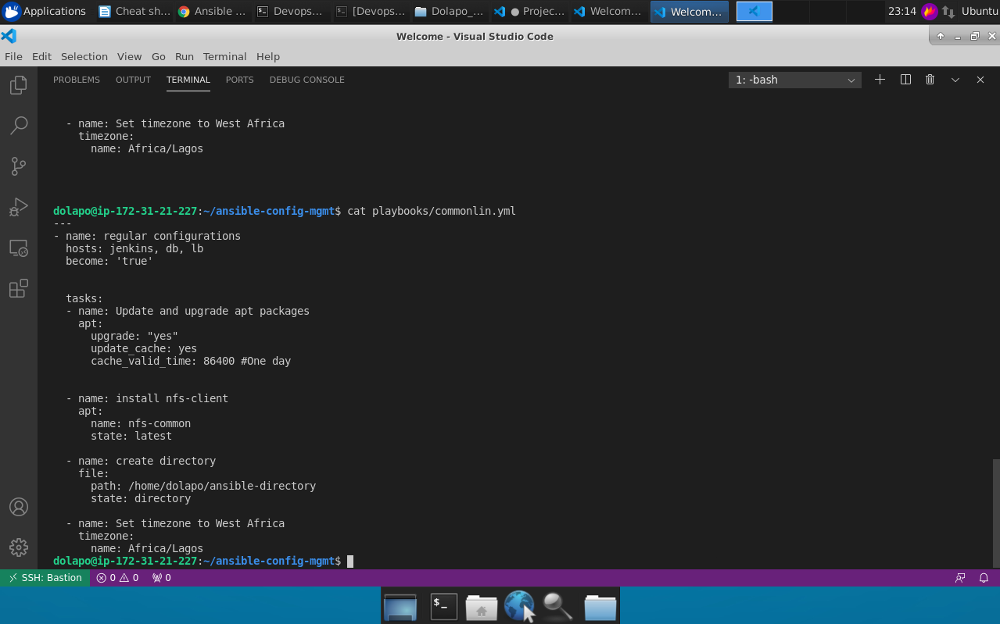
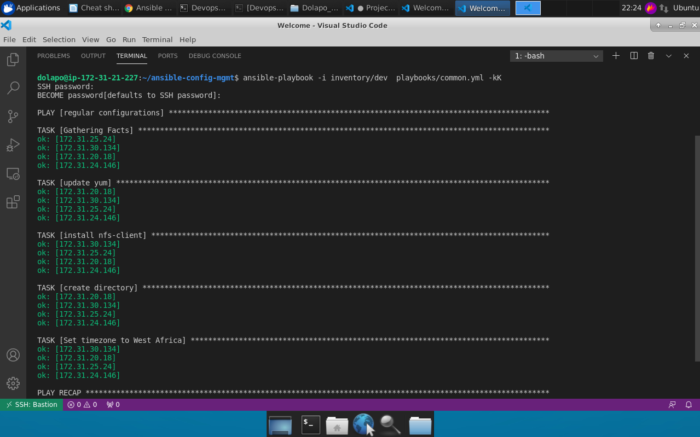
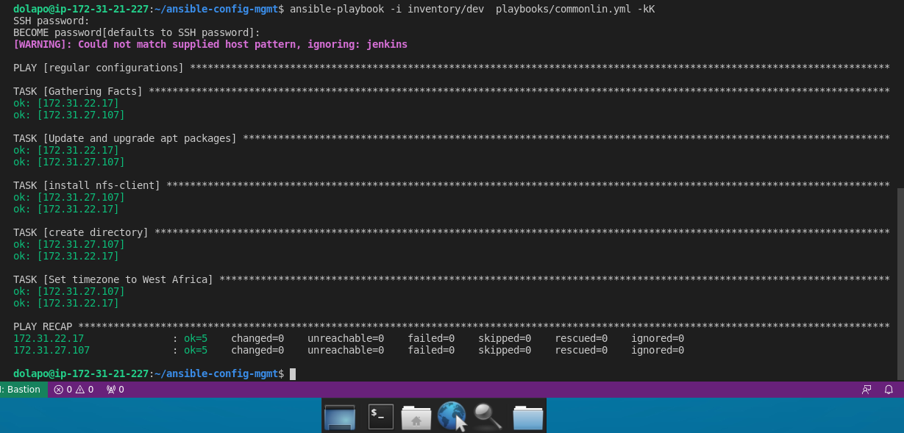

<!--Headings -->
# Ansible Configuration Management - Automate Project 7-10

## Prepare A Jump Server or Bastion Host To Act As Ansible Client

1. Create a VM and call it Bastion. It will serve as a client to run ansible scripts.
2. On the bastion host, create a folder, name it **ansible**, Clone the GitHub repository there.
3. Instal **Ansible**
4. Create a user and grant adminitrative  privileges to the user on every host to be automated

### Begin Ansible Development

1. Within the git repository, create a git branch. You will start developing a new feature in this branch.
The branch name is *ansible1*
- Checkout into the newly created feature branch
2. Create a directory and name it **playbooks**. This will be used to store all your playbook files
3. Create a directory and name it **inventory**. This will be used to keep your hosts organised.
4. Within the playbooks folder, create your first playbook, and name it **common.yml**. This playbook will be used for rhel servers. Another playbook **commonlin.yml** will be used for ubuntu servers.
5. Within the inventory folder, create an inventory file for each environment (Development, Staging Testing and Production) **dev**, **stagin**g, **uat**, and **prod** respectively.

## Setting up the Ansible Inventory


### The inventory is setup on inventory/dev


### Setting up Playbooks
1. Common.yml


2. Commonlin.yml


## The play

- common.yml


- commonlin.yml


### To execute ansible

```bash
ansible-playbook -i inventory/dev  playbooks/commonlin.yml -kK


ansible-playbook -i inventory/dev  playbooks/common.yml -kK
```
