## Ansible Refactoring & Static Assignments (Imports)

### Refactoring is a general term in computer programming. It means making changes to the source code without changins expected behaviour of the software. The main idea of refactoring is to enhance code readability, increase maintainability and extensibility, reduce complexity, add proper comments without affecting the logic.

## Step 1 - Jenkins job enhancement

### Before we begin, let us make some changes to our Jenkins job - now every new change in the codes creates a separate directory which is not very convenient when we want to run some commands from one place. Besides, it consumes space on Jenkins serves with each subsequent change. Let us enhance it by introducing a new Jenkins project/job - we will require Copy Artifact plugin.

1. Jenkins-Ansible server and create a new directory called **ansible-config-mgt2**

`mkdir /home/ubuntu/ansible-config-mgt2`

- Change permissions to this directory, so Jenkins could save files there - 

`chmod -R 0777 /home/ubuntu/ansible-config-mgt2`

2. Go to Jenkins web console -> Manage Jenkins -> Manage Plugins -> on Available tab search for Copy Artifact and install this plugin without restarting Jenkins

3. Create a new Freestyle project and name it **save_artifacts**.
This project will be triggered by completion of my existing ansible project. Configuration is shown below:

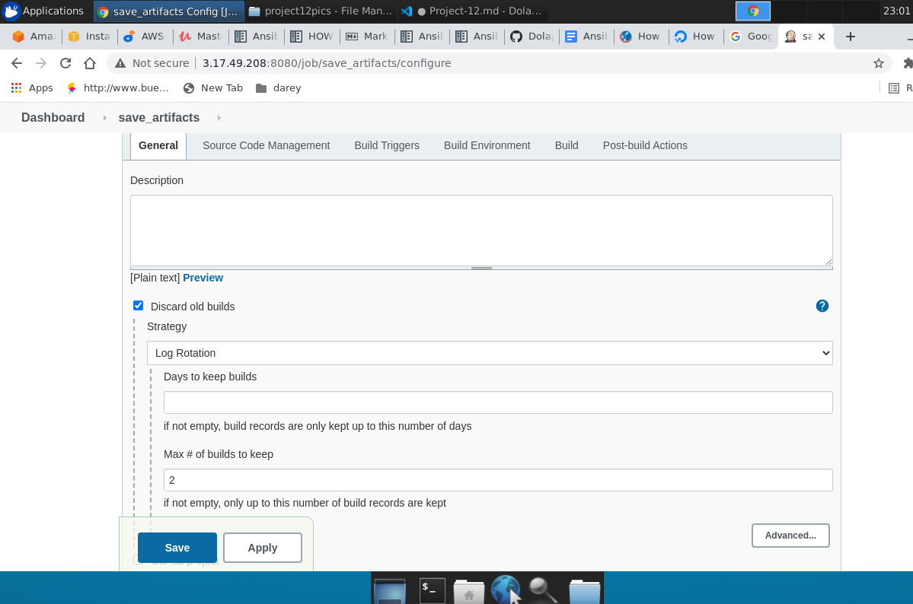

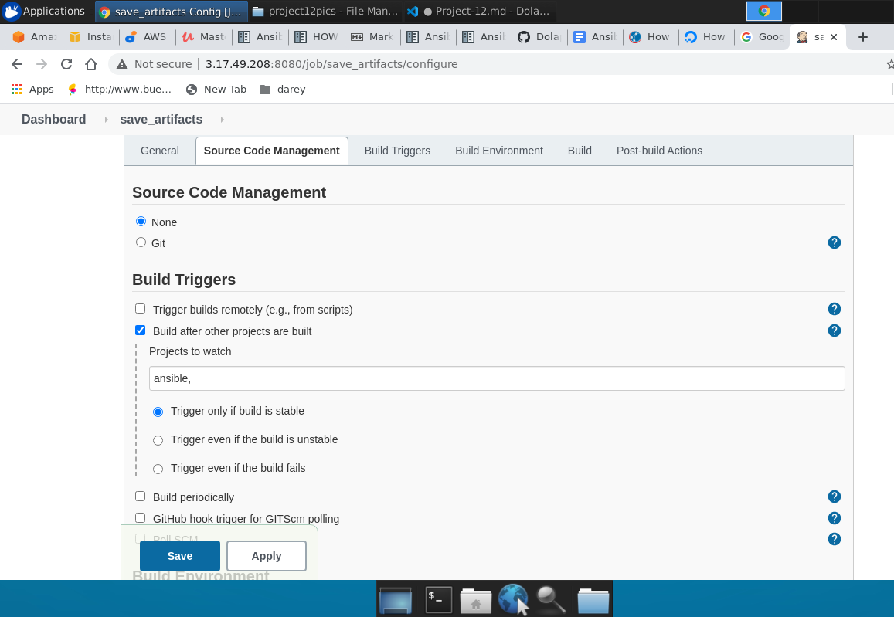

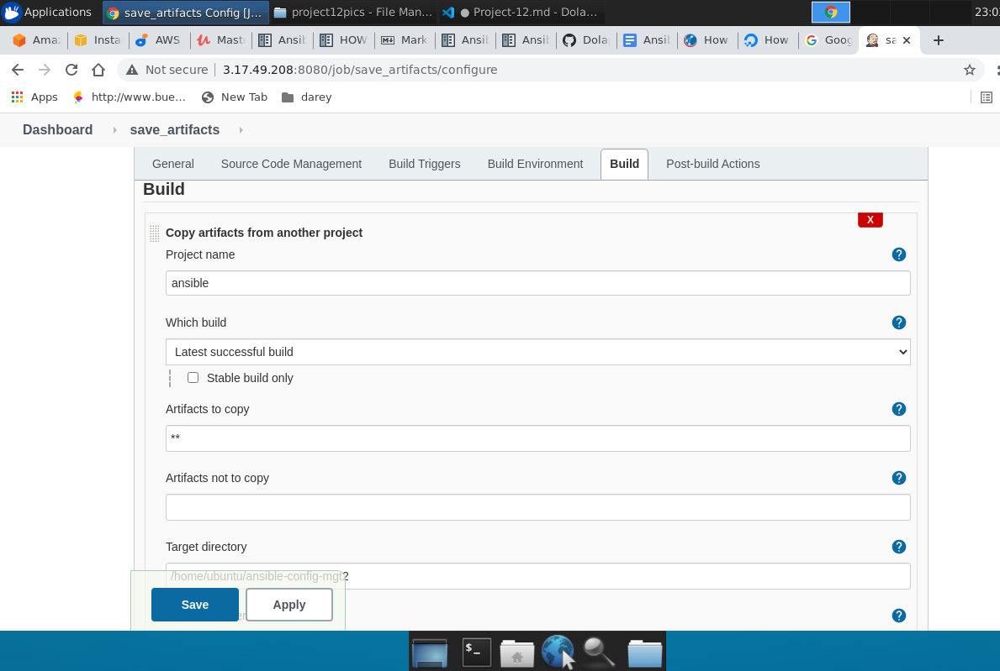

Note: You can configure number of builds to keep in order to save space on the server, for example, you might want to keep only last 2 or 5 build results. You can also make this change to your **ansible** job.

The main idea of **save_artifacts** project is to save artifacts into **/home/ubuntu/ansible-config-mgt2** directory. To achieve this, we created a Build step and choose **Copy artifacts from other project**, specified **ansible** as a source project and **/home/ubuntu/ansible-config-mgt2** as a target directory.

Test your set up by making some change in README.MD file inside the **ansible-config-mgt repository** (right inside master branch).

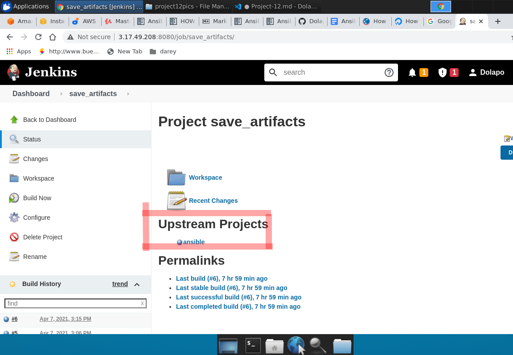

## Step 2 - Refactor Ansible code by importing other playbooks into **site.yml**

Let see code re-use in action by importing other playbooks.

1. Within playbooks folder, create a new file and name it site.yml - This file will now be considered as an entry point into the entire infrastructure configuration. Other playbooks will be included here as a reference. In other words, site.yml will become a parent to all other playbooks that will be developed. Including common.yml that you created previously. Dont worry, you will understand more what this means shortly.
2. Create a new folder in root of the repository and name it static-assignments. The static-assignments folder is where all other children playbooks will be stored. This is merely for easy organization of your work. It is not an Ansible specific concept, therefore you can choose how you want to organize your work. You will see why the folder name has a prefix of static very soon. For now, just follow along.
3. Move common.yml file into the newly created static-assignments folder.
4. Inside site.yml file, import common.yml playbook.

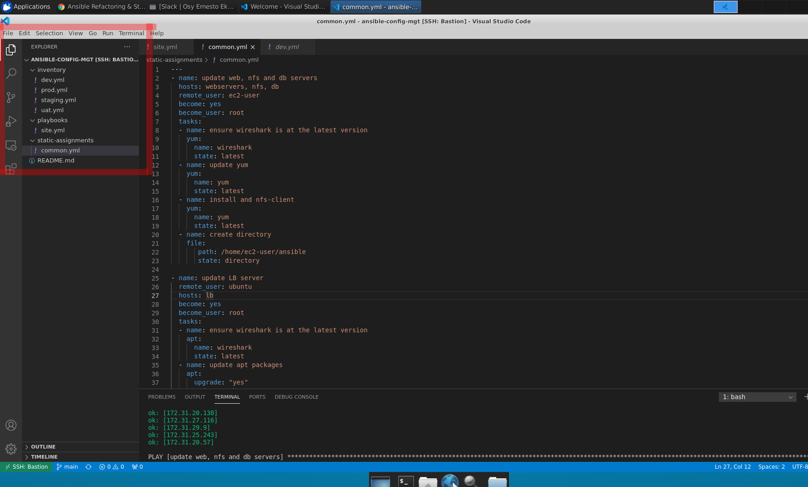

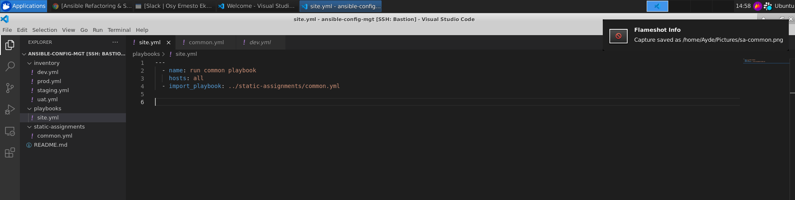

Run **ansible-playbook** command against the **dev** environment

`sudo ansible-playbook -i /var/lib/jenkins/jobs/ansible/builds/6/archive/inventory/dev.yml /var/lib/jenkins/jobs/ansible/builds/6/archive/playbooks/site.yml`

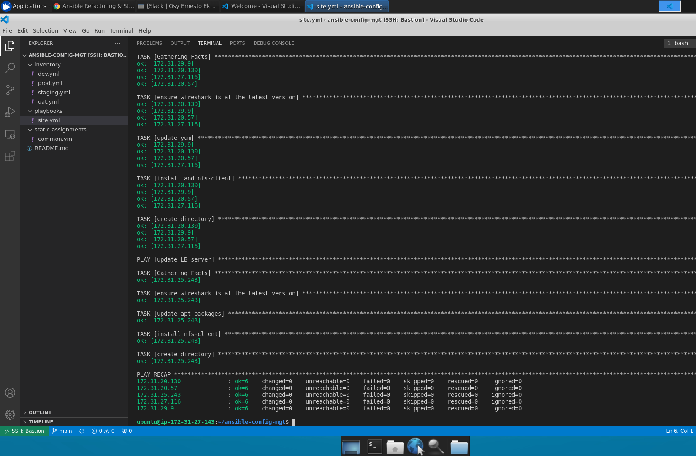

- Since you need to apply some tasks to your dev servers and wireshark is already installed - you can go ahead and create another playbook under **static-assignments** and name it **common-del.yml**. In this playbook, configure deletion of wireshark utility.

```
---
- name: update web, nfs and db servers
  hosts: webservers, nfs, db
  remote_user: ec2-user
  become: yes
  become_user: root
  tasks:
  - name: delete wireshark
    yum:
      name: wireshark
      state: removed

- name: update LB server
  hosts: lb
  remote_user: ubuntu
  become: yes
  become_user: root
  tasks:
  - name: delete wireshark
    apt:
      name: wireshark-qt
      state: absent
      autoremove: yes
      purge: yes
      autoclean: yes

```
- update **site.yml** with 

`- import_playbook: ../static-assignments/common-del.yml`

instead of common.yml and run it against dev servers:

`sudo ansible-playbook -i /home/ubuntu/ansible-config-mgt/inventory/dev.yml /home/ubuntu/ansible-config-mgt/playbooks/site.yml`

## Step 3 - Configure UAT Webservers with a role ‘Webserver’

We have our nice and clean dev environment, so let us put it aside and configure 2 new Web Servers as uat. We could write tasks to configure Web Servers in the same playbook, but it would be too messy, instead, we will use a dedicated role to make our configuration reusable.

Launch 2 fresh EC2 instances using RHEL 8 image, we will use them as our uat servers, so give them names accordingly - Web1-UAT and Web2-UAT.

Tip: Do not forget to stop EC2 instances that you are not using at the moment to avoid paying extra. For now, you only need 2 new RHEL 8 servers as Web Servers and 1 existing Jenkins-Ansible server up and running.

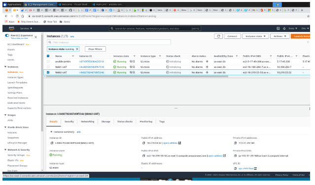

To create a role, you must create a directory called roles/, relative to the playbook file or in /etc/ansible/ directory.

Use an Ansible utility called **ansible-galaxy** inside **ansible-config-mgt/roles** directory (you need to create roles directory upfront)

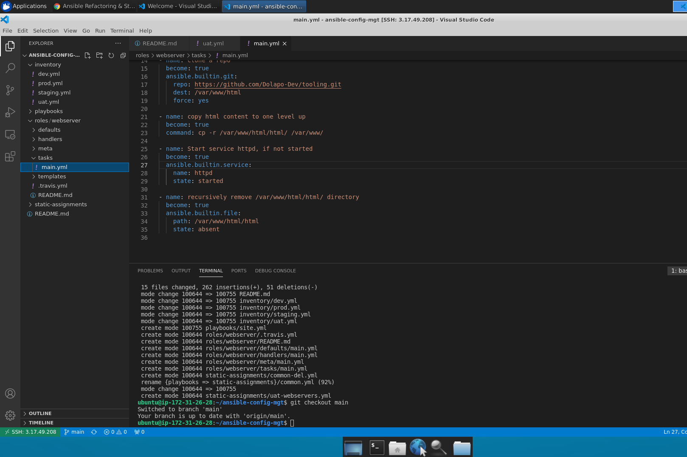

```
mkdir roles
cd roles
ansible-galaxy init webserver
```

**Note**: You can choose either way, but since you store all your codes in GitHub, it is recommended to create folders and files there rather than locally on Jenkins-Ansible server.

Update your inventory **ansible-config-mgt/inventory/uat.yml** file with IP addresses of your 2 UAT Web servers

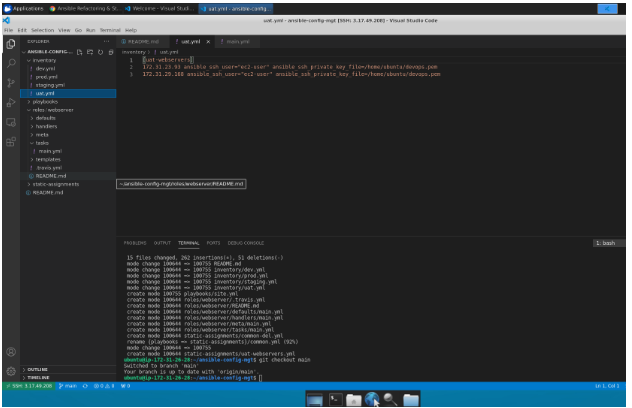


1. In **/etc/ansible/ansible.cfg** file uncomment roles_path string and provide a full path to your roles directory **roles_path = /home/ubuntu/ansible-config-mgt/roles**, so Ansible could know where to find configured roles.
2. It is time to start adding some logic to the webserver role. Go into tasks directory, and within the main.yml file, start writing configuration tasks to do the following:
- Install and configure Apache (httpd service)
- Clone Tooling website from GitHub https://github.com/<your-name>/tooling.git.
- Ensure the tooling website code is deployed to /var/www/html on each of 2 UAT Web servers.
Make sure httpd service is started

**main.yml will consist of

```
---
- name: install apache
  become: true
  ansible.builtin.yum:
    name: "httpd"
    state: present

- name: install git
  become: true
  ansible.builtin.yum:
    name: "git"
    state: present

- name: clone a repo
  become: true
  ansible.builtin.git:
    repo: https://github.com/<your-name>/tooling.git
    dest: /var/www/html
    force: yes

- name: copy html content to one level up
  become: true
  command: cp -r /var/www/html/html/ /var/www/

- name: Start service httpd, if not started
  become: true
  ansible.builtin.service:
    name: httpd
    state: started

- name: recursively remove /var/www/html/html/ directory
  become: true
  ansible.builtin.file:
    path: /var/www/html/html
    state: absent
```

## Step 4 - Reference ‘Webserver’ role

Within the static-assignments folder, create a new assignment for uat-webservers uat-webservers.yml. This is where you will reference the role.

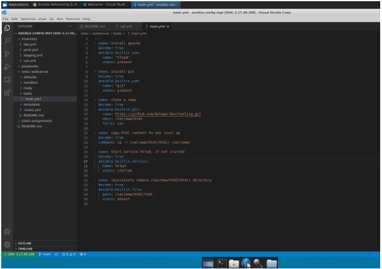

Remember that the entry point to our ansible configuration is the site.yml file. Therefore, you need to refer your uat-webservers.yml role inside site.yml.

So, we should have this in site.yml

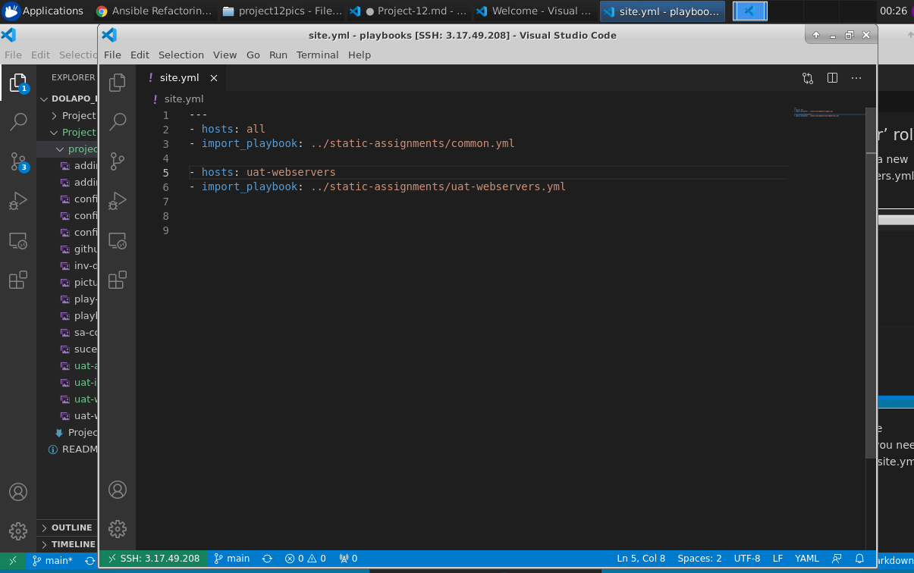

## Step 5 - Commit & Test

Commit your changes, create a Pull Request and merge them to master branch, make sure webhook triggered two consequent Jenkins jobs, they ran successfully and copied all the files to your Jenkins-Ansible server into /home/ubuntu/ansible-config-mgt/ directory.

Now run the playbook against your uat inventory and see what happens:

`sudo ansible-playbook -i /home/ubuntu/ansible-config-mgt/inventory/uat.yml /home/ubuntu/ansible-config-mgt/playbooks/site.yml`

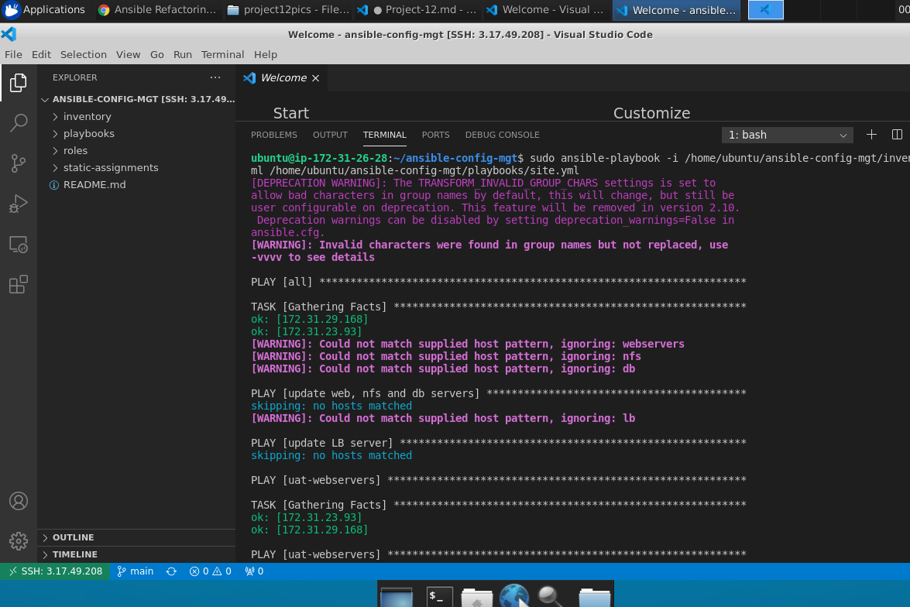

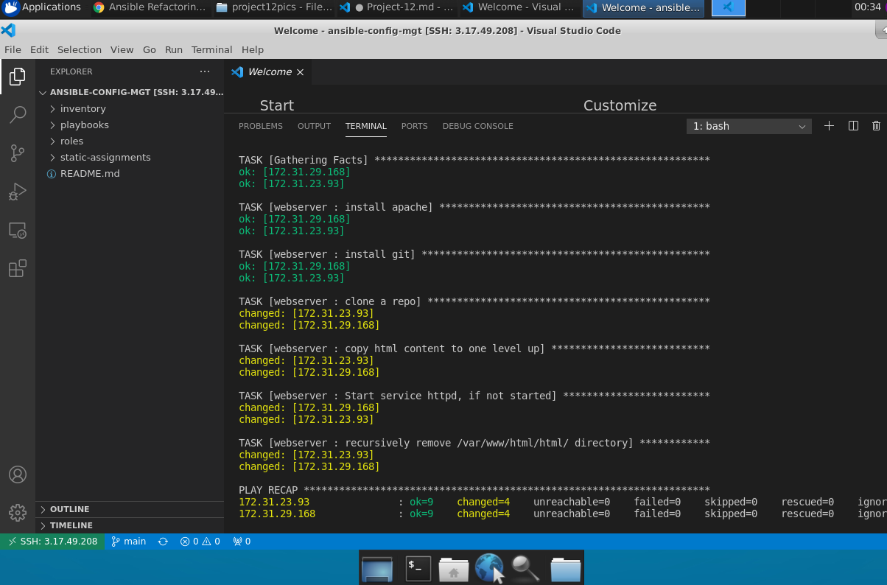

You should be able to see both of your UAT Web servers configured and you can try to reach them from your browser:

`http://<Web1-UAT-Server-Public-IP-or-Public-DNS-Name>/index.php`


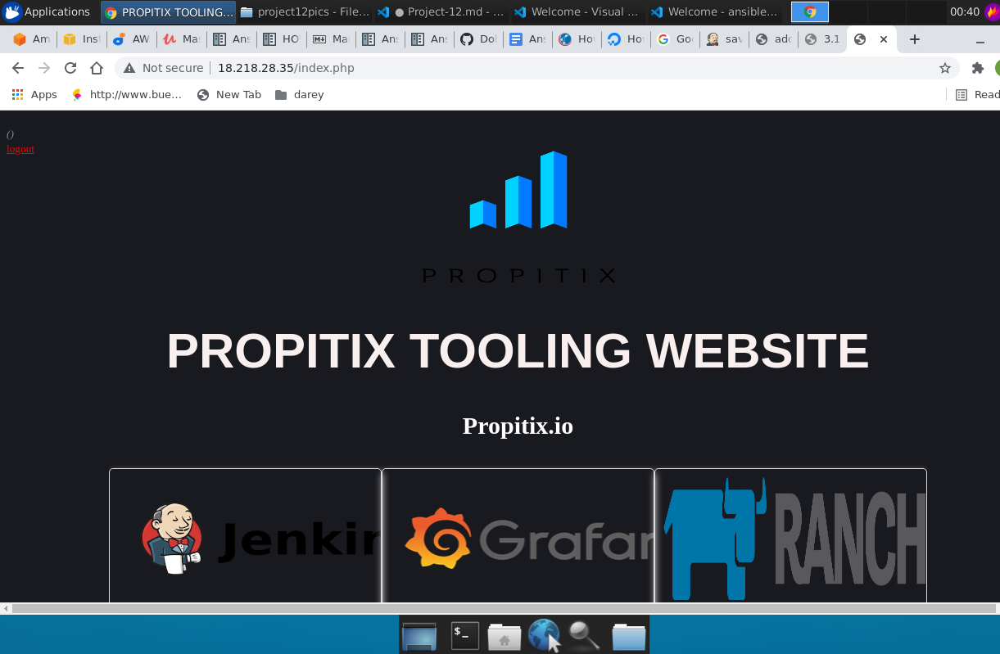

# success